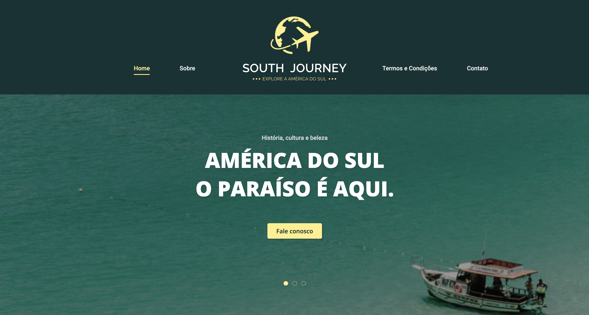
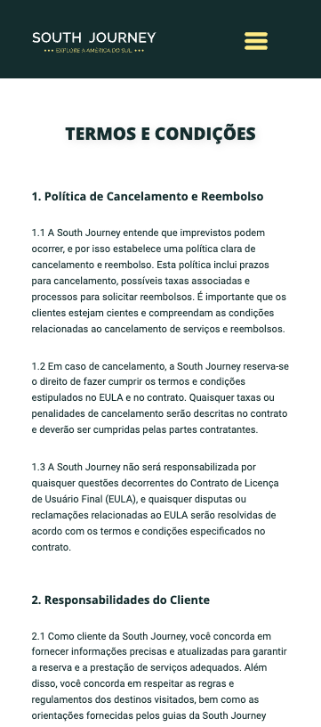
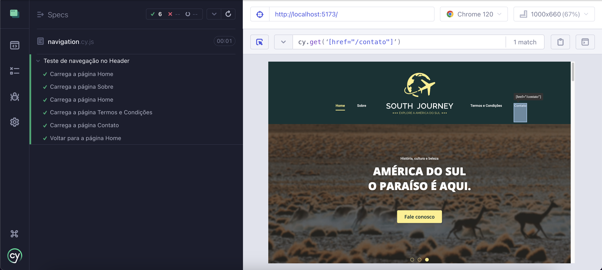

# South Journey

Este projeto faz parte do MVP da disciplina Sprint III: Desenvolvimento Front-end Avançado, pós-graduação PUC-Rio.

A South Journey é uma agência fictícia, a qual realiza excursões em países da América do Sul. Com o foco no desenvolvimento front-end e utilizando a biblioteca React.js, o objetivo da aplicação é exercer o papel de interface de interação com o usuário, onde quatro páginas foram desenvolvidas seguindo os princípios de componentização e fazendo uso de recursos do React (como props e hooks, por exemplo).


Deploy: https://south-journey.vercel.app

Projeto no Figma: https://www.figma.com/community/file/1309687243943078973/south-journey

Repositório do back-end: https://github.com/ThiagoTerraDev/restful-api-nodejs







## Como executar a aplicação

Será necessário ter o Node.js, ou o npm, instalados.

Após clonar o repositório, é necessário ir ao diretório raiz desse projeto pelo terminal para poder executar os comandos descritos abaixo:


```
$ npm install

```


Este comando instala as dependências/bibliotecas descritas no arquivo package.json. Uma pasta chamada "node_modules" será criada.

Para executar a interface, basta executar o comando:


```
$ npm run dev

```

Abra o localhost no navegador.


## Como executar os Testes

Para os testes End-to-End: Após executar o projeto do front end, através das instruções supracitadas, abra um novo terminal, navegue até o diretório raiz do projeto e execute o seguinte comando:

```
$ npm run tests

```

Em seguida, selecione a opção "E2E Testing" e execute os testes no Chrome. Clique no arquivo "navigation.cy.js".




## Principais tecnologias utilizadas:

 


## Motivação

Decidi ir além dos pré-requisitos definidos pela minha instituição de pós-graduação, para o MVP em questão, ao buscar desenvolver um projeto full stack completo. O intuito é consolidar ainda mais os meus conhecimentos e experiência atuando com as tecnologias supracitadas, como, também, na esfera do back-end (repositório mencionado anteriormente).


## Status: em desenvolvimento

Algumas melhorias e funcionalidades serão implementadas, no intuito de otimizar ainda mais a experiência do usuário. São elas:

- Autenticação: Implementação de cadastro e login.
- Criação de novas páginas e seções: para login e cadastro; detalhamento de cada excursão, serviços adicionais que poderão ser contratados; página de checkout.
- Ajustes na responsividade do site.
- Envio das informações preenchidas no formulário ao back-end.
- Implementação de testes de componentes com Cypress.


## Entre em contato

Estou à disposição para esclarecer dúvidas e oferecer o suporte necessário. Entre em contato pelo e-mail thiagoterradev@gmail.com
